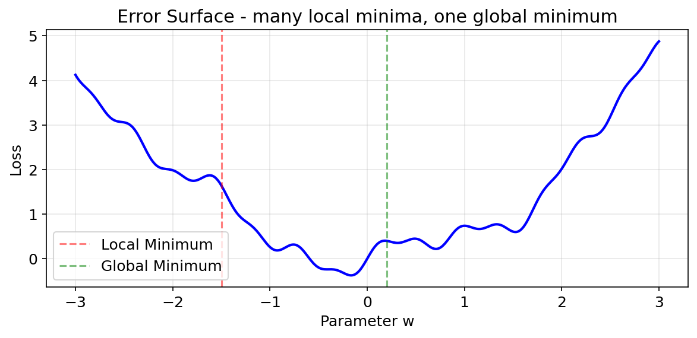

# Error Surface（误差曲面）

**优先级：⭐ 重要**

## 一句话

> **Error Surface = 把模型参数和 loss 画出来的"地形图"。** 横轴是参数值，纵轴是 loss 大小。



## 直观理解

想象你在山谷里蒙眼下山找最低点：

```
         loss 高（参数差）
            /\
           /  \        ← 这就是 error surface
     _____/    \_____
    /                \      loss 低（参数好）
   /      最低点       \
  /      （你要找的）    \
```

- **x 轴**：模型参数（权重 w）
- **y 轴**：Loss 值（模型错得多离谱）
- **整个曲面**：每个参数组合对应的 loss

## 为什么不是光滑的碗？

理想的 error surface 是碗形：

```
    \_/    ← 好找，一个最低点
```

但实际的 error surface 是坑坑洼洼的：

```
  _/\_/\_/\/\_    ← 充满局部极小值和平坦区域
```

三种困难地形：

| 地形 | 问题 |
|---|---|
| **局部最小值** | 看起来是最低点，但不是真正的谷底 |
| **平坦区域（高原）** | 梯度很小，参数几乎不动 |
| **陡峭区域** | 梯度很大，容易一步迈过头（overshoot） |

## 关联知识

- → 这就是需要 **Momentum** 的原因：冲过小坑
- → 这就是需要 **自适应学习率** 的原因：不同地形用不同步长
