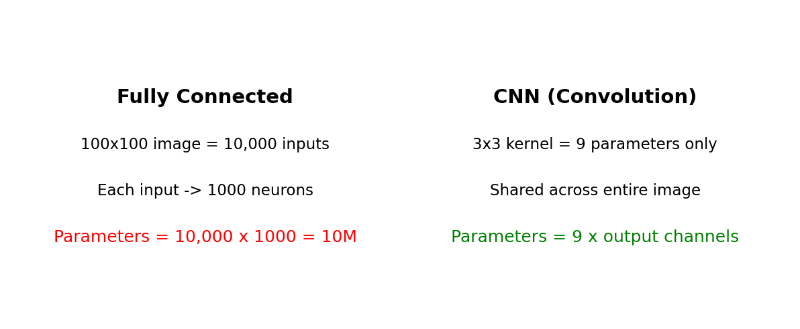

# 为什么需要 CNN

**优先级：⭐⭐⭐ 重要**

**对应课件：** `cnn_v4.pdf` 第 2-16 页

---

## 一句话

> **全连接网络处理图片参数太多，根本算不动。CNN 用三个简化大幅减少参数，同时更适合图像处理。**

---

## 问题：全连接网络处理图片（PPT 第 2-4 页）

一张 100×100 的彩色图片，送入全连接网络：

```python
# 全连接网络
x = torch.randn(1, 3*100*100)       # [1, 30000] ← 拉平后的输入
fc = nn.Linear(30000, 1000)          # 第一层 30000→1000
# 参数数量 = 30000 × 1000 = 30,000,000
```

**问题：参数太多**
- 100×100 的图片 → 30000 个像素 → 每个都连接下一层所有神经元
- 参数数量 = 输入 × 输出，轻松上千万
- 更大的图片（1000×1000）直接算不动

### 补充：输入列向量如何进入网络

你可能想问：**这 30000 个像素值是怎么送入 1000 个神经元的？**

输入列向量 [30000]   ← 30000 个像素值排成一列
     ↓
     ↓ 同时送入每一个神经元
     ↓
┌───神经元 1 ← 用自己的权重 w₁ 对全部 30000 个值加权求和 + b₁
├───神经元 2 ← 用自己的权重 w₂ 对全部 30000 个值加权求和 + b₂
├───神经元 3 ← 用自己的权重 w₃ 对全部 30000 个值加权求和 + b₃
│  ...
└───神经元 1000 ← 用自己的权重 w₁₀₀₀ 对全部 30000 个值加权求和 + b₁₀₀₀
     ↓
输出向量 [1000]   ← 1000 个神经元各输出一个值

不是"逐个送入"，而是**一次矩阵乘法同时算完**：

```python
# 全连接层的内部运算
# out = W @ x + b
#  ↑     ↑    ↑
# [1000] [1000×30000] @ [30000] + [1000]

# PyTorch 里
fc = nn.Linear(30000, 1000)      # 定义了 W[1000×30000] 和 b[1000]
x = torch.randn(30000)           # 输入向量
out = fc(x)                      # 一次矩阵乘法，算完 1000 个神经元的输出
```

图中的每一条线代表一个权重，30000 个输入 × 1000 个神经元 = **3000 万条线（参数）**。



---

## CNN 的三个核心观察（PPT 第 5-27 页）

### 观察 1：检测特征只需要看局部（PPT 第 5-10 页）

> 你要检测一张图里有没有"鸟嘴"，不需要看整张图，看嘴那一小块区域就够了。

**简化 1：感受野（Receptive Field）**

每个神经元只连接输入的一小块区域（比如 3×3）
而不是连接所有像素
→ 参数大幅减少

全连接：一个神经元连 30000 个像素 → 30000 个权重
CNN：    一个神经元连 3×3 区域  → 9 个权重

### 观察 2：相同特征可能出现在不同位置（PPT 第 11-16 页）

> 鸟嘴可能在图片的左上角，也可能在右下角。检测"嘴"的那个检测器应该整图通用。

**简化 2：参数共享（Weight Sharing）**

同一个卷积核（filter）在整个图片上滑动扫描
不管鸟嘴在哪个位置，都用同一组参数去检测
→ 参数不随图片尺寸变大而增加

不同位置的"嘴检测器"共享同一组权重
→ 卷积核的参数数量 = 3 × 3 = 9（与图片大小无关！）

### 观察 3：下采样不影响识别（PPT 第 27 页）

> 把图片缩小一半，你仍然能认出里面有没有鸟。所以可以压缩图片尺寸减少计算量。

**简化 3：池化（Pooling）**

每隔 2×2 的区域取一个最大值（或平均值）
图片尺寸减半，但关键特征保留
→ 进一步减少参数量

---

## 三个简化对参数量的影响

以 100×100 彩色图片分类为例：

| | 全连接 | CNN |
|---|---|---|
| 第一层参数 | 30,000 × 1000 = **3000 万** | 3×3×3×16 = **432**（16个卷积核） |
| 位置不变性 | ❌ 猫在左边→只认识左边 | ✅ 卷积核全图扫描 |
| 随图片变大 | 参数平方级增长 | 参数不变（卷积核固定） |

**CNN 的核心思想就是：用"对图像任务的先验知识"（局部性+重复性+可压缩性）来减少模型的参数。**

---

## 关联知识

- → 第八集学的 **Batch Normalization** 在 CNN 中通常放在 Conv 之后、激活函数之前
- → 后面学 **Transformer** 时你会发现，Self-Attention 可以看作"动态的卷积"，不再固定感受野
