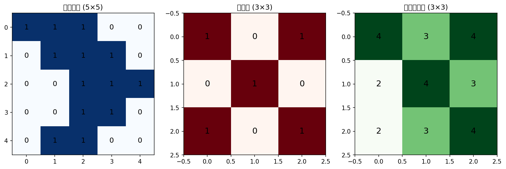
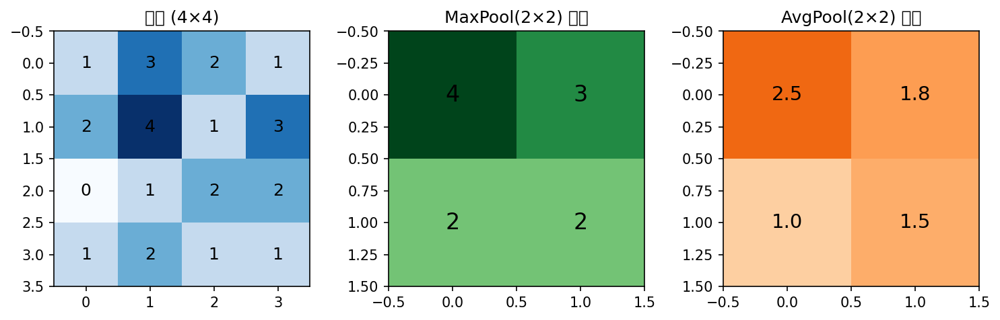

# CNN 核心操作

**优先级：⭐⭐⭐ 重要（本集核心）**

**对应课件：** `cnn_v4.pdf` 第 17-29 页

---

## 一句话

> 💡 **CNN 两层核心：卷积层（Conv）提取特征 + 池化层（Pooling）压缩尺寸。**

---

## 操作一：卷积 / Convolution（PPT 第 17-26 页）

⚠️ **跟池化的区别：卷积是学特征的，池化是压缩图片的。下文会对比。**

### 卷积核 / Filter / Kernel

卷积核 = 一个小的权重矩阵（如 3×3），在图片上滑动扫描。

**计算过程：**



Step 1: 卷积核盖在图片左上角 3×3 区域
Step 2: 对应位置相乘，再全部相加
        1×1 + 1×0 + 1×1 + 0×0 + 1×1 + 1×0 + 0×1 + 0×0 + 1×1 = 4
Step 3: 向右滑动 1 步（stride=1），重复计算
Step 4: 扫完整个图片 → 得到一张特征图

### 一个卷积层有多个卷积核

16 个卷积核 = 检测 16 种不同的特征
  → 有的检测横线
  → 有的检测竖线
  → 有的检测颜色
  → 有的检测纹理

多个卷积核的输出堆叠在一起 → 多个"特征图"（feature maps）

### 形状变化

```python
# 输入：彩色图片
x = torch.randn(32, 3, 32, 32)    # [B, 通道数, 高, 宽]

# 卷积层
conv = nn.Conv2d(
    in_channels=3,      # 输入通道数（RGB=3）
    out_channels=16,    # 输出通道数（使用16个卷积核）
    kernel_size=3,      # 卷积核大小 3×3
    padding=1,          # 外圈补零，保持尺寸不变
    stride=1            # 滑动步长
)

out = conv(x)
print(out.shape)        # [32, 16, 32, 32]
#                      #  ↑  ↑  尺寸不变（padding=1）
#                      batch  16 个特征图
```

**参数数量计算：**
每个卷积核：3 × 3 × 3（RGB三通道）= 27 个权重 + 1 个偏置 = 28
16 个卷积核：28 × 16 = 448 个参数

对比全连接：同样输入输出需要 3×32×32 × 16×32×32 ≈ 5000 万参数

---

## 操作二：池化 / Pooling（PPT 第 27-29 页）

池化 = 对图片做**下采样 / down-sampling**，缩小尺寸但保留关键信息。

### Max Pooling / 最大池化（最常用）



在 2×2 区域里取最大值：
  覆盖区域 [1,3,2,4] → 取最大值 4
  滑动到下一个 2×2 → 取最大值 3
  → 尺寸减半（4×4 → 2×2）

### Average Pooling（平均池化）

取 2×2 区域的平均值：
  [1,3,2,4] → (1+3+2+4)/4 = 2.5

### 形状变化

```python
pool = nn.MaxPool2d(kernel_size=2, stride=2)
# 或简写：nn.MaxPool2d(2)

x = torch.randn(32, 16, 32, 32)
out = pool(x)
print(out.shape)        # [32, 16, 16, 16]
#                              高和宽减半
```

---

## 补充概念

### Padding（填充）

卷积后尺寸会变小（5×5 用 3×3 卷积 → 3×3），如果想保持尺寸不变，在图片外圈补 0：

```python
# 3×3 卷积核，padding=1 → 输入输出尺寸相同
nn.Conv2d(3, 16, kernel_size=3, padding=1)   # [B,3,32,32] → [B,16,32,32]

# 5×5 卷积核，padding=2 → 输入输出尺寸相同
nn.Conv2d(3, 16, kernel_size=5, padding=2)   # [B,3,32,32] → [B,16,32,32]
```

### Stride（步长）

卷积核每次滑动的步数：

```python
nn.Conv2d(3, 16, kernel_size=3, stride=2)    # 步长=2 → 输出尺寸减半
# [B,3,32,32] → [B,16,15,15]（32/2≈15）
```

---

---

## 重点区分：卷积 vs 池化（你容易搞混的地方）

两者都用一个小窗户（kernel size）在图上滑，但完全不一样：

| | 卷积 / Convolution | 池化 / Pooling |
|---|---|---|
| **英文** | Convolution | Pooling |
| **目的** | 提取特征（检测边缘、纹理） | 压缩尺寸（缩小图片） |
| **有无权重** | ✅ **有**权重，要训练 | ❌ **没有**权重，不训练 |
| **参数** | 卷积核的值是学出来的 | 没有参数学，固定取最大/平均 |
| **输出尺寸** | 不变或稍变小（padding 控制） | **减半**（2×2 pooling 后宽高减半） |
| **通俗理解** | 用放大镜仔细看每个区域"有什么" | 看完后把笔记缩印到便利贴上 |

```
一句话记区别：
  卷积 → 有参数，学特征
  池化 → 没参数，缩图片
```

---

🔗 ## 关联知识

- → 卷积核就是**特征检测器**，第一层检测简单特征（边缘、颜色），深层检测复杂特征（脸、物体）
- → 后续学 **Transformer** 时也会用到 Query/Key/Value 的注意力机制，可以看作一种"动态卷积"
