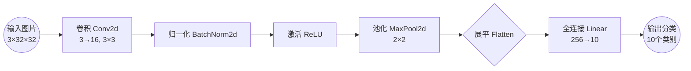

# CNN 架构与应用

**优先级：⭐⭐ 重要（理解层面）**

**对应课件：** `cnn_v4.pdf` 第 30-35 页

---

## 一句话

> 💡 **经典 CNN = 卷积层提取特征 → 池化层压缩 → 展平 → 全连接层分类。**

**流程图（VS Code 预览可看到图形）：**



---

## 经典 CNN 架构（PPT 第 30 页）

```python
import torch.nn as nn

class SimpleCNN(nn.Module):
    def __init__(self):
        super().__init__()
        # 特征提取部分：Conv → ReLU → Pooling 重复堆叠
        self.features = nn.Sequential(
            # 第一层
            nn.Conv2d(3, 16, 3, padding=1),   # [B,3,32,32] → [B,16,32,32]
            nn.ReLU(),
            nn.MaxPool2d(2),                   # [B,16,32,32] → [B,16,16,16]
            
            # 第二层
            nn.Conv2d(16, 32, 3, padding=1),  # [B,16,16,16] → [B,32,16,16]
            nn.ReLU(),
            nn.MaxPool2d(2),                   # [B,32,16,16] → [B,32,8,8]
            
            # 第三层
            nn.Conv2d(32, 64, 3, padding=1),  # [B,32,8,8] → [B,64,8,8]
            nn.ReLU(),
            nn.MaxPool2d(2),                   # [B,64,8,8] → [B,64,4,4]
        )
        
        # 分类部分：展平 → 全连接 → 输出
        self.classifier = nn.Sequential(
            nn.Flatten(),                      # [B,64,4,4] → [B,1024]
            nn.Linear(64*4*4, 256),            # [B,1024] → [B,256]
            nn.ReLU(),
            nn.Linear(256, 10),                # [B,256] → [B,10]（10类）
        )
    
    def forward(self, x):
        x = self.features(x)
        x = self.classifier(x)
        return x
```

### 完整形状变化

输入图片:        [B, 3, 32, 32]           ← 32×32 彩色图
  ↓ Conv(3→16)   [B, 16, 32, 32]
  ↓ ReLU         [B, 16, 32, 32]          ← 激活函数，不改变形状
  ↓ MaxPool(2)   [B, 16, 16, 16]          ← 尺寸减半
  ↓ Conv(16→32)  [B, 32, 16, 16]
  ↓ MaxPool(2)   [B, 32, 8, 8]
  ↓ Conv(32→64)  [B, 64, 8, 8]
  ↓ MaxPool(2)   [B, 64, 4, 4]            ← 最终特征图
  ↓ Flatten      [B, 64×4×4=1024]         ← 展平为向量
  ↓ Linear       [B, 256]
  ↓ Linear       [B, 10]                  ← 10 个类别的分数

---

## 应用：围棋（PPT 第 31-33 页）

为什么围棋能用 CNN？

| 理由 | 对应 CNN 特性 |
|---|---|
| 棋盘 19×19，可以看作图片 | 输入就是 19×19 的图像 |
| 落子只影响局部区域 | 卷积核只看局部 |
| 相同棋型在不同位置意义相同 | 参数共享 |
| 不需要整盘棋的像素级精度 | 池化下采样不损失关键信息 |

这是 CNN 的第一个著名"非图像"应用——AlphaGo 用 CNN 分析棋局。

---

## CNN 的局限（PPT 第 35 页）

| 局限 | 说明 | 解决方案 |
|---|---|---|
| **不具备旋转不变性** | 把猫图片旋转 90°，CNN 可能认不出 | 数据增强（训练时随机旋转/翻转图片） |
| **不具备缩放不变性** | 放大/缩小图片，CNN 可能认不出 | 多尺度训练 |
| **只能看局部** | 无法捕捉全局关系 | Transformer 的 Self-Attention 解决了这个问题 |

> 这也是为什么后来 **Vision Transformer (ViT)** 在某些任务上超越了 CNN——ViT 用自注意力机制直接捕捉全局关系。

---

🔗 ## 关联知识

- → 第八集学的 **Batch Normalization** 通常加在 Conv → **BN** → ReLU 之间
- → 下一集可能是 Self-Attention / Transformer，跟 CNN 刚好互补（CNN 擅长局部，Transformer 擅长全局）
- → 你后面学模型部署时，CNN 的部署比 Transformer 更成熟（量化、剪枝有很多现成工具）
