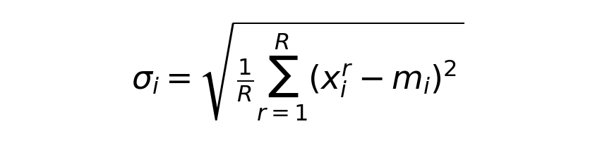

# 为什么需要归一化

**优先级：⭐⭐⭐ 重要**

**对应课件：** `normalization_v4.pdf` 第 2-4 页

---

## 一句话

> **不同特征的数值范围差异导致 error surface 崎岖不平，归一化让地形变平滑，梯度下降更容易走。**
error surface 是loss function 的函数图像
---

## 问题：Changing Landscape（PPT 第 2-3 页）
假设两个参数 w1 和 w2，它们的输入 x1 和 x2 范围不同
x1 范围小（0~1），x2 范围大（100~200）
w1 方向 → loss 变化小 → 地形平坦 → 梯度小 → 学得慢
w2 方向 → loss 变化大 → 地形陡峭 → 梯度大 → 易震荡

---

结果：

error surface 在 w1 方向平坦，w2 方向陡峭
梯度下降走 Z 字形，训练困难
---
## 解决方案：Feature Normalization（PPT 第 4 页）

对输入数据的**每个特征维度**做归一化：


公式中的两个统计量：




| 符号 | 含义 | 例子：面积特征 |
|---|---|---|
| x_i^r | 第 r 个样本的第 i 个特征 | 第 3 套房面积=200 |
| mi | 所有样本在特征 i 上的均值 | (120+80+200)/3≈133 |
| σi | 所有样本在特征 i 上的标准差 | ~49 |

归一化后：
- 每个特征均值=0，标准差=1
- 所有特征尺度一致，error surface 更接近圆形
- 梯度更新直指最低点，训练更快

---

## 代码示例

```python
import torch

# 原始数据：3个样本，2个特征（面积，房间数）
x = torch.tensor([[120.0, 3.0], [80.0, 2.0], [200.0, 5.0]])

# 手动归一化
mean = x.mean(dim=0)
std = x.std(dim=0)
x_norm = (x - mean) / std

print(x_norm)
# [[-0.27, -0.27],
#  [-1.08, -1.07],
#  [ 1.35,  1.33]]
```
```

---

## 关联知识

- → 这跟之前学的 **RMSProp/Adam** 解决的是**同一个问题**：不同参数尺度不一致
- → Normalization 在**数据层面**解决（改输入），RMSProp 在**优化器层面**解决（改梯度更新方式）
- → 两者不冲突，实际项目中**同时使用**
