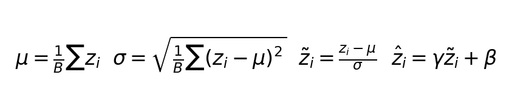

# Batch Normalization 原理

**优先级：⭐⭐⭐ 重要（本集核心）**
**课件：** `normalization_v4.pdf` 第 5-9 页

---

💡 **一句话：对每一层的输出做归一化，方法跟 Feature Normalization 一样，但 μ 和 σ 基于一个 batch 算。**

---

## 为什么输入层归一化不够？

输入 x 已经归一化（均值=0，标准差=1），但经过第一层 z = Wx + b 后，分布就变了：

- **均值**：E[z] = E[Wx + b] = W·E[x] + b = W·0 + b = **b**
  均值不再是 0，变成了 b

- **标准差**：Var(z) = Var(Wx + b) = W²·Var(x) = W²·σ²
  标准差 = **|W| × σ(x)**，被 W 的权重值缩放

也就是说：**即使输入归一化好了，W 和 b 也会把均值和标准差改变。**

---

第一层如此，第二层也同样如此：

```
输入 x（均值=0，标准差=1）
  ↓ W1, b1
z1（均值=b1，标准差=|W1|×1）
  ↓ 激活函数
a1（分布又变了）
  ↓ W2, b2
z2（均值=b2，标准差=|W2|×σ(a1)）
  ↓ ...
```

所以每一层都需要 BN，不只是输入层做一次。

---

## BN 计算流程（4 步）

```
Step 1：μ = (z1 + z2 + ... + zB) / B              ← 算 batch 均值
Step 2：σ = sqrt( Σ(zi - μ)² / B )                 ← 算 batch 标准差
Step 3：żi = (zi - μ) / σ                          ← 归一化
Step 4：ẑi = γ·żi + β                              ← 恢复表达能力
```



---

🔑 **关键理解：为什么要有 γ 和 β？**

归一化后数据均值=0、标准差=1，但网络不一定需要数据严格在 0 附近。

- **γ（缩放参数）**：控制输出范围
- **β（偏移参数）**：控制输出偏移
- 网络自己学 γ 和 β 的最优值
- 极端情况：γ = σ，β = μ → BN 退化为恒等映射，什么也不做

BN 的关键设计：**既归一化，又不让数据被固定死。**

---

## 训练 vs 推理的区别

| | 训练时 | 推理时 |
|---|---|---|
| **μ、σ 怎么算** | 用当前 batch 算（每次不同） | 用训练时累计的全局均值/方差（固定值） |
| **为什么** | 每个 batch 的统计量不同，增加随机性 | 推理时没有 batch 概念，必须用固定值 |
| **Batch 大小影响** | batch 太小 → μ、σ 估计不准 | 不受影响（用的是全局统计量） |

---

## 代码示例

```python
import torch.nn as nn
```
导入 PyTorch 的神经网络模块（nn = neural network）。

---

**CNN 部分**

```python
model = nn.Sequential(
```
`Sequential` = 顺序容器。把层按顺序放进去，数据从第一层流到最后层，类似流水线。

```python
    nn.Conv2d(3, 16, 3, padding=1),
```
卷积层：输入 3 通道（RGB 彩色图），输出 16 通道（16 个特征图），卷积核 3×3。

```
形状变化：[B, 3, 32, 32] → [B, 16, 32, 32]
          ↑ 输入通道         ↑ 输出通道
```

```python
    nn.BatchNorm2d(16),
```
BN 层：对上面输出的 16 个通道分别做归一化（PPT 第 6-8 页的内容）。

```python
    nn.ReLU(),
```
激活函数：负数变 0，正数不变。给网络引入非线性能力。

```python
    nn.MaxPool2d(2),
```
池化层：2×2 区域取最大值，宽高减半。`[B, 16, 32, 32] → [B, 16, 16, 16]`

```python
)
```

---

**全连接网络部分**

```python
model = nn.Sequential(
    nn.Linear(784, 256),
```
全连接层：输入 784 个值，输出 256 个值。

```
内部运算：out = W @ x + b
  W 是 [256×784] 的矩阵
  x 是 [784] 的输入向量
  b 是 [256] 的偏置向量
  一次矩阵乘法算完所有输出
```

```python
    nn.BatchNorm1d(256),
```
BN 层：对 256 个神经元的输出做归一化。`BatchNorm1d` 用于全连接层（1D 数据），`BatchNorm2d` 用于 CNN（2D 数据）。

```python
    nn.ReLU(),
    nn.Linear(256, 10),
```
第二层全连接：256 个输入 → 10 个输出（10 个类别）。

```python
)
```

---

🔑 **关键理解：为什么改一个神经元会影响整个层？**

μ 和 σ 是整个层一起算的：

```
μ = (z1 + z2 + ... + zB) / B

改其中一个 zi
  → μ 变了
  → σ 也变了
  → 这层所有神经元的归一化结果都变了
  → 下一层的全部输入也变了
```

这正是 BN 的特点：**任何一个神经元的异常输出会被整体拉回正常范围。**

---

🔗 **关联知识：** Feature Normalization 是 BN 的基础，BN 把归一化从输入层扩展到每一层。
