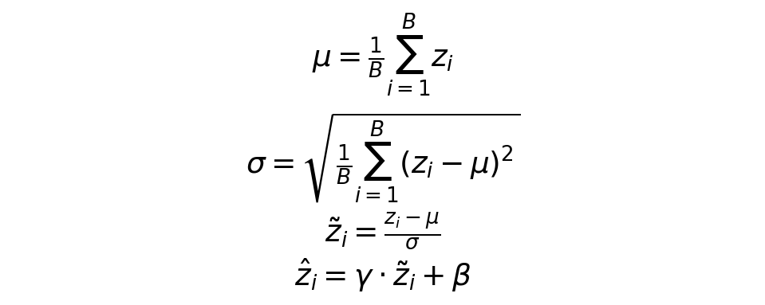

# Batch Normalization 原理

**优先级：⭐⭐⭐ 重要（本集核心）**

**对应课件：** `normalization_v4.pdf` 第 5-9 页

---

## 一句话

> **对神经网络每一层的输出做归一化，方法跟 Feature Normalization 一样，但 μ 和 σ 基于一个 batch 的样本来算。**

---

## 为什么不在输入层做一次就够了？（PPT 第 5 页）

```
输入 x → 第1层 → z₁ → 激活函数 → a₁ → 第2层 → z₂ → ...
  已归一化         分布变了          又乱了
```

即使输入层归一化了：
1. 经过第一层的权重 $W_1$ 计算后，$z_1 = W_1 x$ 的分布**又变了**
2. 不同维度的 $z_1$ 范围再次不一致
3. 所以**每一层**在送入激活函数之前，都需要归一化

---

## BN 计算流程（PPT 第 6-8 页）

对于一个 batch 的样本（B 个），在某一层的输出 $z$ 上：

```
Step 1: 算 batch 均值      μ = (z₁ + z₂ + ... + z_B) / B
Step 2: 算 batch 标准差     σ = sqrt( Σ(z_i - μ)² / B )
Step 3: 归一化              ż_i = (z_i - μ) / σ
Step 4: 恢复表达能力         ẑ_i = γ · ż_i + β
```



---

## 关键理解：为什么要有 γ 和 β？（PPT 第 8 页）

归一化后数据是均值=0、标准差=1 的标准分布，但这个分布**不一定对当前任务最优**：

```python
γ（缩放参数）：控制输出的范围
β（偏移参数）：控制输出的偏移

# 网络通过训练自动学习 γ 和 β 的最优值
# 极端情况：γ = σ，β = μ → BN 退化为恒等映射，什么也不做
```

这是 BN 的关键设计：**既归一化，又不让数据被"固定死"**，网络仍能自己决定合适的分布。

---

## 训练 vs 推理的区别

| | 训练时 | 推理时 |
|---|---|---|
| **μ、σ 怎么算** | 用当前 batch 算（每次不同） | 用训练时累计的**全局**均值/方差（固定值） |
| **为什么** | 每个 batch 的统计量不同，增加随机性 | 推理时没有 batch 概念，必须用固定值 |
| **Batch 大小影响** | batch 太小 → μ、σ 估计不准 | 不受影响（用的是全局统计量） |

---

## 代码示例

```python
import torch.nn as nn

# 在 CNN 中：BN 跟在 Conv 后面，激活函数之前
model = nn.Sequential(
    nn.Conv2d(3, 16, 3, padding=1),   # [B,3,H,W] → [B,16,H,W]
    nn.BatchNorm2d(16),                # [B,16,H,W] → 归一化 16 个通道
    nn.ReLU(),
    nn.MaxPool2d(2),                   
    nn.Conv2d(16, 32, 3, padding=1),  # [B,16,H,W] → [B,32,H,W]
    nn.BatchNorm2d(32),                # 再次归一化
    nn.ReLU(),
)

# 全连接网络中的 BN
model = nn.Sequential(
    nn.Linear(784, 256),               # [B,784] → [B,256]
    nn.BatchNorm1d(256),               # 对 256 个神经元做归一化
    nn.ReLU(),
    nn.Linear(256, 10),
)
```

---

## 为什么改一个神经元会影响整个隐藏层？

这是你之前问过的问题，现在可以完整理解了：

```
归一化公式中有 μ 和 σ
μ = (z₁ + z₂ + ... + z_B) / B

如果你改了其中一个 z_i 的值
→ μ 变了
→ σ 也变了
→ 这层所有神经元的归一化结果 ż 都变了
→ 下一层的全部输入都变了
```

所以 BN 让层的输出**互相依赖**，这正是它稳定训练的方式——**任何一个神经元的异常输出不会独自分叉，而是被整体拉回正常范围。**

---

## 关联知识

- → Feature Normalization 是 BN 的基础，BN 把归一化从输入层扩展到每一层
- → CNN 作业中你会看到 `Conv2d + BN + ReLU` 是经典组合
